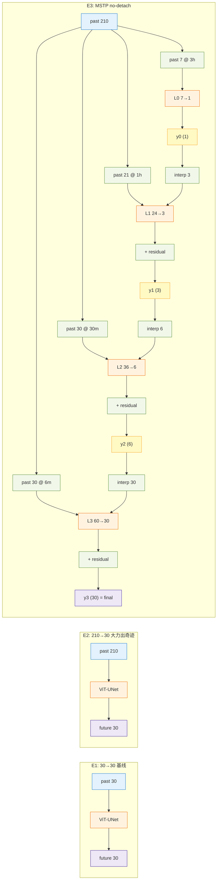

# 重庆数据 · VIT-UNet 时间多尺度外推实验

> SEVIR 五组骨干消融显示 **`vit_unet` 综合最佳**。本文档把它作为统一 backbone 迁到重庆本地雷达 VIL 数据上，对比 4 种"如何使用时间维度"的思路。

---

## 0. 数据

| 项 | 值 |
|---|---|
| 路径 | `C:/Users/97290/Desktop/datasets/2026chongqing/vil_gpu_daily_240_simple` |
| 每文件 | `day_simple_YYYYMMDD.npy`, shape `(240, 384, 384)`, `float32 ∈ [0,1]` |
| 时间步 | 6 min / 帧 → 1 天 = 240 帧 |
| 排除 | **2024 年** (已知问题) |
| 划分 | 按日期升序 `train:val:test = 0.70 : 0.15 : 0.15` (112 / 24 / 24 天) |

帧数-时间对照:

| 时长 | 帧数 |
|---|---|
| 6 min | 1 |
| 30 min | 5 |
| 1 h | 10 |
| 3 h | 30 |
| 21 h | 210 |
| 24 h | 240 |

---

## 1. 骨干统一

四个实验全部用同一个 `ViT-UNet` (Swin-T + UNet, `reduce_stem=true`, AMP)，**只变化输入/输出的时间组织**，这样才是公平消融。

---

## 2. 四个实验

### E1 · 3h → 3h 基线

```
X [B, 30, 384²]  ── ViT-UNet ──▶  Y [B, 30, 384²]
```
- `in=30, out=30, stride=30`; 一天出 4 个样本
- **对照组**: "短输入是否够用"
- 配置: [`configs_chongqing/e1_3h_to_3h.yaml`](configs_chongqing/e1_3h_to_3h.yaml)

---

### E2 · 21h → 3h 大力出奇迹

```
X [B, 210, 384²] ── ViT-UNet ──▶  Y [B, 30, 384²]
```
- 把几乎整天的历史塞进通道维
- **已在 RTX 5070 Laptop 实测 AMP+bs=1 不 OOM**, 2.67 it/s, ~42s/epoch
- `pretrained=false` (210 通道 adapter 和 ImageNet 3 通道权重无对齐价值)
- 一天只出 1 个样本 (`210+30=240`), 训练样本大幅缩水
- 配置: [`configs_chongqing/e2_21h_to_3h.yaml`](configs_chongqing/e2_21h_to_3h.yaml)

---

### E3 · 多尺度时间金字塔 (NO detach)

**核心想法**: 从同一历史 (过去 21h) 用**不同时间步长**采样出 4 个尺度的输入, 让同一模型栈"先预测终点, 再逐级填细节"。**每级输入都 ≤ 30 帧, 总计算量 ≈ 4 × E1, 远小于 E2**。

| Level | stride | 过去覆盖 | `in` | `out` | 未来粒度 |
|---|---|---|---|---|---|
| L0 | 30 (3h) | 7×3h = 21h | 7 | 1 | 3h 终点 1 帧 |
| L1 | 10 (1h) | 21×1h = 21h | 21 | 3 | 每 1h 一帧 |
| L2 | 5 (30min) | 30×0.5h = 15h | 30 | 6 | 每 30min 一帧 |
| L3 | 1 (6min) | 30×0.1h = 3h | 30 | 30 | 全分辨率 |

> 所有 `in` 和 `out` 都 ≤ 30, 避免了 210 通道怪物。

**级间连接 (UNet 式 skip + residual)**:

```
y_{i-1}  ──time_interp──▶ y_{i-1}_up  (插值到第 i 级帧数)
                              │
past_i ──┐                    │  (可选 .detach())
         ▼                    ▼
       concat  ───▶  ViT-UNet_i  ───▶  Δ_i
                                          │
           y_i = y_{i-1}_up + Δ_i  ◀──────┘   (残差加)
```

**深度监督损失**: future (30帧) 按相同 stride 切片监督每一级
$$
\mathcal{L} = w_0\,\ell(y_0, f_{[29:30]}) + w_1\,\ell(y_1, f_{[9::10]}) + w_2\,\ell(y_2, f_{[4::5]}) + w_3\,\ell(y_3, f)
$$
默认 `w = (0.1, 0.2, 0.3, 1.0)`，让 L3 (最终输出) 主导梯度。

**residual_connection 模式**: `detach_between_stages = False`
- 梯度从 L3 的 loss 可一路回传到 L0
- 各级**一起优化**, 形式上等价于一个带深度监督的大网络

配置: [`configs_chongqing/e3_mstc_nodetach.yaml`](configs_chongqing/e3_mstc_nodetach.yaml)

---

### E4 · 多尺度时间金字塔 (WITH detach)

与 E3 **完全同结构**, 只有一行差别 — 在级间插入 `.detach()`:

```python
y_{i-1}_up = time_interp(y_{i-1}, n_i).detach()   # ← detach 在这
```

**关键点** (符合你说的"即使 detach 一些计算的参数也可以相互作用"):

即使梯度被切断, 下一级仍然通过两种方式**前向**获得上一级的数值:

1. **concat 进输入** — `cat([past_i, y_{i-1}_up])` 把上层预测直接喂进本级
2. **残差锚** — `y_i = y_{i-1}_up + Δ_i`, 上层预测作为数值基底

因此 detach 模式下:
- 每级**只被自己的 loss 驱动** (不必扭曲权重去配合后级)
- 但下级仍然**看得到**上级的输出, 数值层面协同并没有消失

损失权重默认 `w = (1.0, 1.0, 1.0, 1.0)`，让各级平等学好各自的任务。

配置: [`configs_chongqing/e4_mstc_detach.yaml`](configs_chongqing/e4_mstc_detach.yaml)

---

## 3. E3 vs E4 预期对比

| 角度 | E3 (no detach) | E4 (detach) |
|---|---|---|
| 梯度路径 | L3 → L2 → L1 → L0 全贯通 | 每级梯度只在自己那层 |
| 数值信息路径 | 全贯通 | **同样全贯通** (concat + 残差锚) |
| 参数协同 | 强: L0 可能会为了配合 L3 而退化 | 弱: L0 只对"3h 终点"负责 |
| 过拟合风险 | 低 (深度监督正则) | 较高 (每级自己 overfit) |
| 训练稳定性 | loss 初期三条信号交叠可能抖 | 更平稳, 各级收敛独立 |
| 可拆解性 | 去掉 L3 会性能塌 | 去掉后级 L0 仍独立可用 |
| 论文表述 | "端到端多尺度深度监督" | "模块化可插拔的时间金字塔" |

---

## 4. 计算量 / 显存对比

| 实验 | in 通道 (每级) | 级数 | 相对显存 | 一天样本数 |
|---|---|---|---|---|
| E1 | 30 | 1 | **1×** | 4 |
| E2 | 210 | 1 | ~3× | 1 |
| E3 | 7 / 24 / 36 / 60 | 4 | ~4× (但每级都很小) | 1 |
| E4 | 同 E3 | 4 | 略低 (detach 少存 graph) | 1 |

E2 输入通道 210 看似极端, 但实测 RTX 5070 Laptop + AMP 能跑; E3/E4 虽有 4 级, 但每级通道都 ≤ 60, 压力反而分散。

---

## 5. 运行

```powershell
conda activate rtx5070_cu128    # 已验证该环境有 CUDA
cd C:\Users\97290\Desktop\data_driven

# 单个实验
python train_chongqing.py --config configs_chongqing/e1_3h_to_3h.yaml
python train_chongqing.py --config configs_chongqing/e3_mstc_nodetach.yaml
python train_chongqing.py --config configs_chongqing/e4_mstc_detach.yaml
python train_chongqing.py --config configs_chongqing/e2_21h_to_3h.yaml

# 一键跑全部 (顺序 E1 → E3 → E4 → E2, OOM 自动跳过)
python run_chongqing_all.py
```

**结果位置**
```
checkpoints_cq/<tag>/best.pt       # 最优权重
checkpoints_cq/<tag>/result.json   # test loss + 指标
logs_cq/<tag>/                     # TensorBoard 曲线
logs_cq/<tag>.stdout.log           # 标准输出日志 (run_all 写)
```

---

## 6. 代码结构

```
data_driven/
├── data/chongqing_dataset.py          # 重庆 daily npy loader
├── models/
│   ├── single_model.py                # ViTUNet (backbone)
│   └── multiscale_cascade.py          # MSTC 4 级金字塔 + 深度监督损失
├── configs_chongqing/
│   ├── e1_3h_to_3h.yaml               # 30→30
│   ├── e2_21h_to_3h.yaml              # 210→30
│   ├── e3_mstc_nodetach.yaml          # 4 级金字塔, 梯度贯通
│   └── e4_mstc_detach.yaml            # 4 级金字塔, 数值贯通
├── train_chongqing.py                 # 统一训练入口 (AMP + OOM 捕获)
├── run_chongqing_all.py               # 4 实验流水线
└── CHONGQING_EXPERIMENTS.md           # 本文档
```

---

## 7. 评估指标

延用 [`utils/metrics.py`](utils/metrics.py):

- **MSE / MAE** — 像素级
- **CSI / POD / FAR** — 阈值 `[16, 74, 133, 160, 181]` (轻/中/重/极端/暴雨)
- **CSI_avg** — 5 阈值均值, 作为早停/模型选择主指标

MSTC 模型的验证只统计 `out["final"]` (= `y3`)。

---

## 8. 总图



E4 结构与 E3 完全相同, 仅在 `interp 3/6/30` 节点后加 `.detach()` (梯度断, 数值过)。

---

## 9. 下一步

- E5: 用 [`Mythos-Earthformer`](models/mythos_earthformer.py) 的循环瓶颈替换 E3 的 4 个独立 ViT-UNet, 在同一个循环单元里完成时间多尺度
- E6: 多模态 (VIL + IR/VIS) 的 4 级时间金字塔
